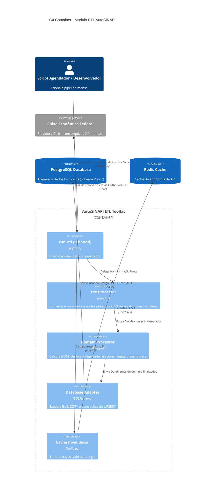

# 📐 Arquitetura do Módulo — autoSINAPI ETL

Este documento detalha o design interno e a arquitetura técnica da biblioteca **autoSINAPI ETL**.

---

## 1. Organização do Código (DDD & MVC-Hexagonal)

A biblioteca é estruturada como um componente autônomo. Embora seja empacotada em Python, ela respeita o desacoplamento de portas e adaptadores para permitir que a camada de persistência e a de aquisição de dados sejam substituíveis.

```
autosinapi/
├── __init__.py          # Ponto de entrada (Inbound Port: run_etl)
├── config.py            # Configurações de execução e mapeamento de constantes
├── exceptions.py        # Exceções personalizadas de domínio
├── etl_pipeline.py      # Orquestrador do pipeline (Domain Service)
└── core/                # Adaptadores e lógica de processamento
    ├── database.py      # Outbound Adapter: Conector e DML PostgreSQL
    ├── downloader.py    # Outbound Adapter: Cliente de aquisição HTTP (Caixa)
    ├── pre_processor.py # Domain Service: Conversão de planilhas para CSV
    └── processor.py     # Domain Service: Parseamento lógico dos dados (Pandas)
```

---

## 2. Portas e Adaptadores (Arquitetura Hexagonal)

### 2.1. Inbound Ports (Portas de Entrada)
*   **`run_etl` (API do Pacote):** Função exposta no arquivo raiz `__init__.py`. Ela recebe parâmetros opcionais (`db_config`, `sinapi_config`, `mode`) e orquestra a chamada para o pipeline.
*   **CLI Handler:** Adaptador de linha de comando (`__main__.py` ou comando em scripts de Makefile) que invoca o `run_etl`.

### 2.2. Outbound Ports (Portas de Saída)
*   **Database Interface (`Database`):** Porta de persistência de dados. A implementação padrão ([database.py](file:///z:/repos/autosinapi_api/AutoSINAPI/autosinapi/core/database.py)) conecta-se ao PostgreSQL usando SQLAlchemy.
*   **Cache Invalidation Interface:** Porta para expurgar chaves do cache no Redis após a conclusão do processamento.
*   **Downloader Client (`Downloader`):** Porta para baixar arquivos da Caixa Econômica via requisições HTTP ([downloader.py](file:///z:/repos/autosinapi_api/AutoSINAPI/autosinapi/core/downloader.py)).

---

## 3. Modelo de Domínio e Fluxo do Processador (C4 Container)

O parser de planilhas realiza a consolidação das informações seguindo a arquitetura abaixo:



---

## 4. Tratamento de Chave Estrangeira e Integridade

Como as planilhas brutas do SINAPI apresentam inconsistências frequentes (uma composição pode referenciar itens filhos que não constam no catálogo principal de preços do mesmo mês), o módulo `Processor` executa uma lógica de integridade relacional:
1.  Compara as tabelas filhas de dependência com as chaves primárias dos catálogos de insumos e composições.
2.  Gera DataFrames contendo placeholders para os itens órfãos.
3.  Insere estes placeholders com classificação `'NAO_CLASSIFIDADO'` antes de carregar as tabelas de estruturas, preservando a integridade das `Foreign Keys` no banco.
